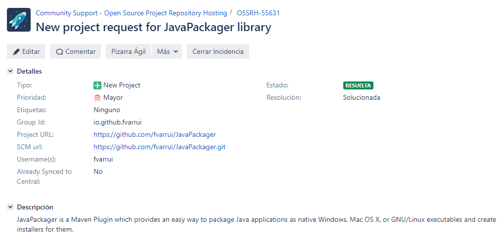

# Cómo publicar tus artefactos en Maven Central

Guía paso a paso sobre cómo publicar tus artefactos (librerías) en Maven Central.

## Pasos previos

1. Asegurarnos de tener instalados un JDK, Maven, Git.

2. [Crear una cuenta de GitHub](https://help.github.com/articles/signing-up-for-a-new-github-account/), si no disponemos de una.
3. [Crear un nuevo repositorio en GitHub](https://help.github.com/articles/create-a-repo/).
4. [Añadir una clave SSH](https://help.github.com/es/github/authenticating-to-github/adding-a-new-ssh-key-to-your-github-account) a nuestra cuenta de GitHUb.

5. [Publicar nuestro código (push)](https://help.github.com/articles/adding-an-existing-project-to-github-using-the-command-line/) en el nuevo repositorio de GitHub.
6. [Crear un cuenta en el JIRA de Sonatype](https://issues.sonatype.org/secure/Signup!default.jspa).
7. [Crear una incidencia](https://issues.sonatype.org/secure/CreateIssue.jspa?issuetype=21&pid=10134) para solicitar un nuevo proyecto (por [ejemplo](https://issues.sonatype.org/browse/OSSRH-55631)).



> GroupID debe corresponder con el utilizado en el artefacto que queremos publicar.

8. [Instalar GNU PG](https://www.gnupg.org/download/) y comprobar que está correctamente instalado:

```bash
C:\Users\fvarrui>gpg --version
gpg (GnuPG) 2.2.19
libgcrypt 1.8.5
Copyright (C) 2019 Free Software Foundation, Inc.
License GPLv3+: GNU GPL version 3 or later <https://gnu.org/licenses/gpl.html>
This is free software: you are free to change and redistribute it.
There is NO WARRANTY, to the extent permitted by law.

Home: C:/Users/fvarrui/AppData/Roaming/gnupg
Algoritmos disponibles:
Clave pública: RSA, ELG, DSA, ECDH, ECDSA, EDDSA
Cifrado: IDEA, 3DES, CAST5, BLOWFISH, AES, AES192, AES256, TWOFISH,
         CAMELLIA128, CAMELLIA192, CAMELLIA256
Resumen: SHA1, RIPEMD160, SHA256, SHA384, SHA512, SHA224
Compresión: Sin comprimir, ZIP, ZLIB, BZIP2
```

9. Generar un par de claves (pública y privada):

```bash
C:\Users\fvarrui>gpg --full-generate-key
gpg (GnuPG) 2.2.19; Copyright (C) 2019 Free Software Foundation, Inc.
This is free software: you are free to change and redistribute it.
There is NO WARRANTY, to the extent permitted by law.

Por favor seleccione tipo de clave deseado:
   (1) RSA y RSA (por defecto)
   (2) DSA y ElGamal
   (3) DSA (sólo firmar)
   (4) RSA (sólo firmar)
  (14) Existing key from card
Su elección: 1
las claves RSA pueden tener entre 1024 y 4096 bits de longitud.
¿De qué tamaño quiere la clave? (2048) 2048
El tamaño requerido es de 2048 bits
Por favor, especifique el período de validez de la clave.
         0 = la clave nunca caduca
      <n>  = la clave caduca en n días
      <n>w = la clave caduca en n semanas
      <n>m = la clave caduca en n meses
      <n>y = la clave caduca en n años
¿Validez de la clave (0)? 0
La clave nunca caduca
¿Es correcto? (s/n) s

GnuPG debe construir un ID de usuario para identificar su clave.

Nombre y apellidos: Fran Vargas
Dirección de correo electrónico: fvarrui@acme.com
Comentario:
Ha seleccionado este ID de usuario:
    "Fran Vargas <fvarrui@acme.com>"

¿Cambia (N)ombre, (C)omentario, (D)irección o (V)ale/(S)alir? v
Es necesario generar muchos bytes aleatorios. Es una buena idea realizar
alguna otra tarea (trabajar en otra ventana/consola, mover el ratón, usar
la red y los discos) durante la generación de números primos. Esto da al
generador de números aleatorios mayor oportunidad de recoger suficiente
entropía.
gpg: clave FA0FCA1FD999C5DA marcada como de confianza absoluta
gpg: certificado de revocación guardado como 'C:/Users/fvarrui/AppData/Roaming/gnupg/openpgp-revocs.d\CE3004011CA4897B0FC71A51FA0FCA1FD999C5DA.rev'
claves pública y secreta creadas y firmadas.

pub   rsa2048 2020-03-07 [SC]
      CE3004011CA4897B0FC71A51FA0FCA1FD999C5DA
uid                      Fran Vargas <fvarrui@acme.com>
sub   rsa2048 2020-03-07 [E]
```

10. Introducir una contraseña para proteger las claves generadas:


11. Publicar las claves GPG en un servidor de claves:

```bash
gpg --keyserver pool.sks-keyservers.net --send-keys [KEY_ID]
```

> Para publicar la clave generada antes, KEY_ID debe corresponder con: **CE3004011CA4897B0FC71A51FA0FCA1FD999C5DA**.

## Publicar el artefacto

1. Añadir el plugin de despliegue al POM:

```xml
<plugin>
    <artifactId>maven-deploy-plugin</artifactId>
    <version>2.8.2</version>
    <executions>
        <execution>
            <id>default-deploy</id>
            <phase>deploy</phase>
            <goals>
	            <goal>deploy</goal>
            </goals>
        </execution>
    </executions>
</plugin>
```

2. Añadir también la siguiente sección de gestión de distribución al POM:

```xml
<distributionManagement>
    <snapshotRepository>
        <id>ossrh</id>
        <url>https://oss.sonatype.org/content/repositories/snapshots</url>
    </snapshotRepository>
    <repository>
        <id>ossrh</id>
        <url>https://oss.sonatype.org/service/local/staging/deploy/maven2/</url>
    </repository>
</distributionManagement>
```

3. Añadir el servidor `ossrh` en el fichero `settings.xml` de configuración de Maven en el directorio  M2_REPO:

```xml
<settings>
    <servers>
        <server>
            <id>ossrh</id>
            <username>your-jira-id</username>
            <password>your-jira-pwd</password>
        </server>
    </servers>
</settings>
```

>  La etiqueta ID del servidor en `settings.xml` (**ossrh** en este caso) debe coincidir con el ID de `snapshotRepository` y `repository`  del POM.

4. Añadir la sección del sistema de control de versiones (SCM) en el POM:

```xml
<scm>
    <connection>scm:git:git://github.com/fvarrui/JavaPackager.git</connection>
    <developerConnection>scm:git:git@github.com:fvarrui/fvarrui.git</developerConnection>
    <url>https://github.com/fvarrui/JavaPackager</url>
    <tag>HEAD</tag>
</scm>
```

5. Añadir los datos del/los desarrollador/es del artefacto en el POM:

```xml
<developers>
    <developer>
        <id>fvarrui</id>
        <name>Francisco Vargas Ruiz</name>
        <url>https://github.com/fvarrui</url>
    </developer>
</developers>
```

6. Añadir los detalles de la licencia del artefacto en el POM:

```xml
<licenses>
    <license>
        <name>GPL-v3.0</name>
        <url>http://www.gnu.org/licenses/gpl-3.0.txt</url>
    </license>
</licenses>
```

7. Añadir el plugin de publicación de Maven:

```xml
<plugin>
    <groupId>org.apache.maven.plugins</groupId>
    <artifactId>maven-release-plugin</artifactId>
    <version>2.5.3</version>
    <configuration>
        <localCheckout>true</localCheckout>
        <pushChanges>false</pushChanges>
        <mavenExecutorId>forked-path</mavenExecutorId>
        <arguments>-Dgpg.passphrase=${gpg.passphrase}</arguments>
    </configuration>
    <dependencies>
        <dependency>
            <groupId>org.apache.maven.scm</groupId>
            <artifactId>maven-scm-provider-gitexe</artifactId>
            <version>1.9.5</version>
        </dependency>
    </dependencies>
</plugin>
```

8. Añadir la contraseña de la clave GPG como un perfil en el fichero de configuración de Maven (`settings.xml`):

```xml
<settings>
    <profiles>
        <profile>
            <id>ossrh</id>
            <activation>
                <activeByDefault>true</activeByDefault>
            </activation>
            <properties>
                <gpg.passphrase>[your_gpg_passphrase]</gpg.passphrase>
            </properties>
        </profile>
    </profiles>
</settings>
```

9. Añadir el plugin de staging de Nexus:

```xml
<plugin>
    <groupId>org.sonatype.plugins</groupId>
    <artifactId>nexus-staging-maven-plugin</artifactId>
    <version>1.6.7</version>
    <extensions>true</extensions>
    <configuration>
        <serverId>ossrh</serverId>
        <nexusUrl>https://oss.sonatype.org/</nexusUrl>
        <autoReleaseAfterClose>true</autoReleaseAfterClose>
    </configuration>
</plugin>
```

10. Configurar la firma de los artefactos durante la publicación:

```xml
<profiles>
    <profile>
        <id>release-sign-artifacts</id>
        <activation>
            <property>
                <name>performRelease</name>
                <value>true</value>
            </property>
        </activation>
        <build>
            <plugins>
                <plugin>
                    <groupId>org.apache.maven.plugins</groupId>
                    <artifactId>maven-gpg-plugin</artifactId>
                    <version>1.6</version>
                    <executions>
                        <execution>
                            <id>sign-artifacts</id>
                            <phase>verify</phase>
                            <goals>
	                            <goal>sign</goal>
                            </goals>
                        </execution>
                    </executions>
                </plugin>
            </plugins>
        </build>
    </profile>
</profiles>
```

11. Indicar en la versión del artefacto dentro del POM que se trata de una versión SNAPSHOT:

```xml
<version>x.y.z-SNAPSHOT</version>
```

12. Añadir los siguientes ficheros a  `.gitignore`, ya que pueden contener información sensible que no deberíamos subir a GitHub: 
    - *release.properties*
    - *pom.xml.releaseBackup*
13. Publicar el artefacto:

```bash
mvn clean
mvn release:prepare
mvn release:perform
```

13. Comunicar en el JIRA mediante un comentario que se ha publicado el artefacto:


14. Verificar el repositorio Sonatype:


15. Transcurridas un par de horas, el artefacto también estará disponible en [search.maven.org](https://search.maven.org/).

