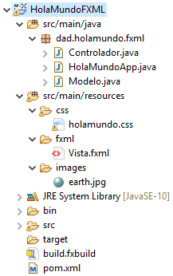
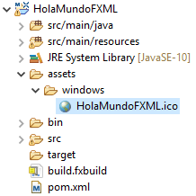

En este guía se explica el proceso para crear un ejecutable (.EXE) y un instalador de una aplicación Java para poder distribuirla.

## Entorno

El entorno en el que se han realizado las pruebas es el siguiente:

* **Windows 10 Pro**
* **Eclipse 2018.12 (4.10.0)**
* **Oracle JDK 10.0.2**

Para generar los instaladores en Windows es necesario disponer de las siguientes aplicaciones:

* [**Inno Setup**](http://www.jrsoftware.org/isdl.php): si queremos generar un asistente de instalación (EXE).
* [**WIX**](http://wixtoolset.org/): si queremos generar un instalador de tipo Microsoft Installer (MSI).

> Son complementarias, por lo que si disponemos de ambas, Maven generará ambos artefactos.

> Para que funcione WIX es necesario que su binario se encuentre en el PATH del sistema. 

## Proyecto de ejemplo: `HolaMundoFXML`

Como ejemplo, se va a usar el siguiente proyecto disponible para su descarga en este [enlace](crear-distribuible-maven-jdk10/HolaMundoFXML.zip):



Es necesario que el proyecto sea de tipo **Maven** para poder crear el distribuible.

## Procedimiento 

Vamos a configurar el proyecto que al ejecutar el comando `mvn package`en la raíz del mismo haga lo siguiente:

Partimos del siguiente fichero `pom.xml` con las propiedades que se indican.

```xml
<project xmlns="http://maven.apache.org/POM/4.0.0"
	xmlns:xsi="http://www.w3.org/2001/XMLSchema-instance"
	xsi:schemaLocation="http://maven.apache.org/POM/4.0.0 http://maven.apache.org/xsd/maven-4.0.0.xsd">
	<modelVersion>4.0.0</modelVersion>
	<groupId>dad</groupId>
	<artifactId>HolaMundoFXML</artifactId>
	<version>0.0.1-SNAPSHOT</version>

	<properties>
        <!-- versión de java para la que se compilará el proyecto -->
		<maven.compiler.source>10</maven.compiler.source>
		<maven.compiler.target>10</maven.compiler.target>
        <!-- codificación utilizada es UTF-8 -->
        <project.build.sourceEncoding>UTF-8</project.build.sourceEncoding>
	</properties>

</project>
```

### 1. Generar el fichero JAR ejecutable

Añadimos el siguiente fragmento dentro de `plugins` para **generar el fichero JAR ejecutable en le directorio `target`**:

```xml
 <plugin>
     <groupId>org.apache.maven.plugins</groupId>
     <artifactId>maven-jar-plugin</artifactId>
     <version>3.1.1</version>
     <configuration>
         <archive>
             <manifest>
				<addClasspath>true</addClasspath>
                <!-- directorio relativo al jar con las librerías (dependencias) -->
				<classpathPrefix>libs/</classpathPrefix>
                <!-- clase principal del proyecto (método main) -->
             	<mainClass>dad.holamundo.fxml.HolaMundoApp</mainClass>
             </manifest>
         </archive>
         <!-- directorio donde se genera el jar (por defecto es 'target') -->
         <outputDirectory>${project.build.directory}</outputDirectory>
     </configuration>
 </plugin>
```

Esto creará el fichero `target\HolaMundoFXML-0.0.1-SNAPSHOT.jar`.

### 2. Copiar las dependencias del proyecto

Añadimos el siguiente fragmento dentro de `plugins` para **copiar todas las dependencias en el directorio `target/app/libs`**: 

```xml
<plugin>
    <groupId>org.apache.maven.plugins</groupId>
    <artifactId>maven-dependency-plugin</artifactId>
    <version>3.1.1</version>
    <executions>
        <execution>
            <id>copy-dependencies</id>
            <phase>prepare-package</phase>
            <goals>
                <goal>copy-dependencies</goal>
            </goals>
        </execution>
    </executions>
    <configuration>
        <!-- directorio de destino de las librerías (target/app/libs) -->
        <outputDirectory>${project.build.directory}/app/libs</outputDirectory>
    </configuration>
</plugin>
```

Esto copiará todos los ficheros JAR (librerías) necesarias para el proyecto en `target\app\libs`.

### 3. Incluir el JRE en el distribuible

Para que la aplicación no dependa de si está el Java Runtime Environment instalado o no en el equipo donde se quiere instalar, distribuiremos nuestra aplicación con un JRE embebido.

Añadimos al `pom.xml` la variable `jre.path` con la ruta al directorio donde está el JRE:

```xml
<properties>
    [...]
    <!-- ruta donde se encuentra el JRE instalado -->
    <jre.path>${env:PROGRAMFILES}\Java\jre-10.0.2</jre.path>
	[...]
</properties>
```

Y luego añadimos el siguiente `plugin` para **copiar el directorio indicado en la variable `jre.path` dentro de `target\app\jre`**: 

```xml
<plugin>
	<groupId>org.apache.maven.plugins</groupId>
    <artifactId>maven-resources-plugin</artifactId>
    <version>3.1.0</version>
    <executions>
        <execution>
            <id>copy-jre</id>
            <phase>validate</phase>
            <goals>
                <goal>copy-resources</goal>
            </goals>
            <configuration>
                <outputDirectory>${project.build.directory}/target/app</outputDirectory>
                <resources>          
                    <resource>
                        <directory>${jre.path}</directory>
                    </resource>
                </resources>              
            </configuration>            
        </execution>
    </executions>
</plugin>
```

Esto copiará el JRE completo a `target\app\jre`.

#### 4. Crea un ejecutable para Windows

Ahora crearemos un ejecutable para Windows a partir del fichero JAR usando Launch4j.

Creamos los directorios `assets\windows` en la raíz del proyecto, y copiamos el icono de la aplicación (.ico) dentro del directorio `windows`, tal y como se observa en la siguiente imagen:



Añadimos el siguiente fragmento dentro de `plugins` para **generar el EXE en `target\app`**: 

```xml
<plugin>
    <groupId>com.akathist.maven.plugins.launch4j</groupId>
    <artifactId>launch4j-maven-plugin</artifactId>
    <version>1.7.25</version>
    <executions>
        <execution>
            <id>generate-windows-executable</id>
            <phase>package</phase>
            <goals>
                <goal>launch4j</goal>
            </goals>
            <configuration>
                <headerType>gui</headerType>
                <!-- directorio donde se encuentra el JAR ejecutable -->
				<jar>${project.build.directory}/${project.name}-${project.version}.jar</jar>
                <!-- ruta del ejecutable generado -->
                <outfile>${project.build.directory}/app/${project.name}.exe</outfile>
                <!-- ruta del icono de la aplicación -->
                <icon>assets/windows/HolaMundoFXML.ico</icon>
                <classPath>
                    <!-- clase principal del jar (la que contiene el main) -->
                    <mainClass>dad.holamundo.fxml.HolaMundoApp</mainClass>
                </classPath>
                <jre>
                    <bundledJre64Bit>true</bundledJre64Bit>
                    <!-- versión del jre -->
                    <minVersion>10.0.2</minVersion>
                    <runtimeBits>64</runtimeBits>
                    <path>jre</path>
                </jre>
                <versionInfo>
                    <!-- información adicional del fichero EXE generado -->
                    <fileVersion>1.0.0.0</fileVersion>
                    <txtFileVersion>1.0.0.0</txtFileVersion>
                    <copyright>Desarrollo de Interfaces</copyright>
                    <fileDescription>${project.description}</fileDescription>
                    <productVersion>${project.version}.0</productVersion>
                    <txtProductVersion>${project.version}.0</txtProductVersion>
                    <productName>${project.name}</productName>
                    <internalName>${project.name}</internalName>
                    <originalFilename>${project.name}.exe</originalFilename>
                </versionInfo>
            </configuration>
        </execution>
    </executions>
</plugin>
```

Lo anterior creará el fichero `target\app\HolaMundoFXML.exe`.

> Ahora mismo, ya sería posible compartir el carpeta `app` completa con nuestra aplicación.

#### 5. Crear un instalador para Windows con Inno Setup

Finalmente, generaremos un instalador que instale todo el contenido del directorio `target\app` en el destino (*Program Files*).

Lo primero será crear el fichero de configuración de Inno Setup (.iss), para lo que utilizamos la herramienta **Inno Setup Compiler**.


Y el contenido deberá quedar más o menos como se muestra a continuación.

```ini
#define MyAppName "HolaMundoFXML"
#define MyAppVersion "0.0.1"
#define MyAppPublisher "Desarrollo de Interfaces"
#define MyAppURL "http://www.iesdomingoperezminik.es"
#define MyAppExeName "HolaMundoFXML.exe"

[Setup]
AppId={{B1DF2591-B0CC-4986-808F-AE3D04D4DA69}}
AppName={#MyAppName}
AppVersion={#MyAppVersion}
AppVerName={#MyAppName} {#MyAppVersion}
AppPublisher={#MyAppPublisher}
AppPublisherURL={#MyAppURL}
AppSupportURL={#MyAppURL}
AppUpdatesURL={#MyAppURL}
DefaultDirName={pf}\{#MyAppName}
DisableProgramGroupPage=yes
OutputDir=..\..\target
OutputBaseFilename={#MyAppName}-{#MyAppVersion}-setup
SetupIconFile={#MyAppName}.ico
Compression=lzma
SolidCompression=yes
UninstallDisplayIcon={app}\{#MyAppExeName}
ArchitecturesInstallIn64BitMode=x64

[Languages]
Name: "english"; MessagesFile: "compiler:Default.isl"
Name: "spanish"; MessagesFile: "compiler:Languages\Spanish.isl"

[Tasks]
Name: "desktopicon"; Description: "{cm:CreateDesktopIcon}"; GroupDescription: "{cm:AdditionalIcons}"; Flags: unchecked

[Files]
Source: "..\..\target\app\*"; DestDir: "{app}"; Flags: ignoreversion recursesubdirs createallsubdirs

[Icons]
Name: "{commonprograms}\{#MyAppName}"; Filename: "{app}\{#MyAppExeName}"
Name: "{commondesktop}\{#MyAppName}"; Filename: "{app}\{#MyAppExeName}"; Tasks: desktopicon

[Run]
Filename: "{app}\{#MyAppExeName}"; Description: "{cm:LaunchProgram,{#StringChange(MyAppName, '&', '&&')}}"; Flags: nowait postinstall skipifsilent
```

> En la ayuda de Inno Setup Compiler (F1) se explican todas las opciones disponibles.

Este fichero lo guardamos en `assets\windows\HolaMundoFXML.iss`, dentro de nuestro proyecto.

Añadimos el siguiente `plugin` para **generar el instalador para Windows en `target`**: 

```xml
<plugin>
    <groupId>org.codehaus.mojo</groupId>
    <artifactId>exec-maven-plugin</artifactId>
    <version>1.6.0</version>
    <executions>
        <execution>
            <id>generate-windows-installer</id>
            <phase>package</phase>
            <goals>
                <goal>exec</goal>
            </goals>
            <configuration>
                <executable>iscc</executable>
                <arguments>
                    <!-- directorio donde se guardará el instalador -->
                    <argument>/O${project.build.directory}</argument>
                    <!-- nombre del fichero del instalador (sin .exe) -->
                    <argument>/F${project.name}_${project.version}_setup</argument>
                    <!-- fichero de configuración de inno setup -->
                    <argument>assets/windows/HolaMundoFXML.iss</argument>
                </arguments>
            </configuration>
        </execution>
    </executions>
</plugin>
```

Esto creará el fichero `target\HolaMundoFXML_0.0.0-SNAPSHOT_setup.exe` con el asistente de instalación de nuestra aplicación. 

> Si ejecutamos el instalador, copiará todo el contenido de `target\app` en `Program files`.

#### 6. Empaquetar nuestro proyecto para su distribución

Por último, ejecutamos con Maven el objetivo `package` desde la opción del menú "Run" > "Run as" > "Maven build...", como se muestra en la siguiente imagen:


O también podemos abrir CMD, desplazarnos al directorio raíz del proyecto y ejecutar el siguiente comando:

```bash
mvn package
```

### Conclusión

De esta forma queda completamente automatizado el proceso de generación del distribuible de nuestra aplicación para Windows, pudiendo instalarla y ejecutarla sin problemas en equipos que no tengan Java.