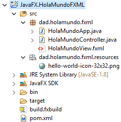
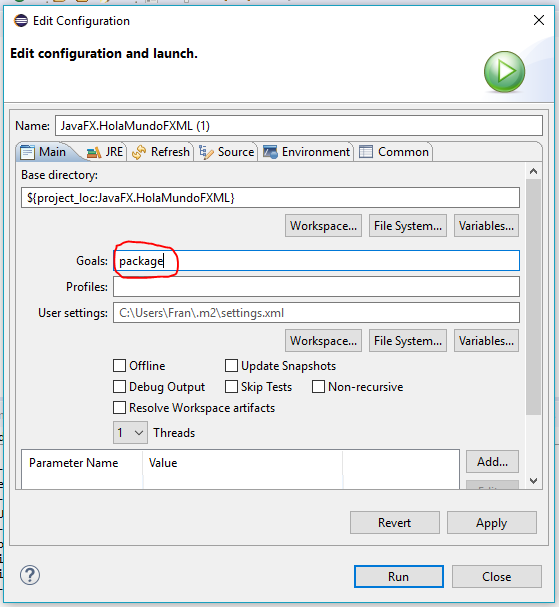

En este guía se explica el proceso para crear un ejecutable (.EXE) y dos tipos de intaladores de una aplicación Java.

La siguiente guía ha sido probada en el siguiente entorno:

* **Windows 10 Enterprise**
* **Eclipse Oxygen.2 Release (4.7.2)**
* **Java JDK 1.8.0_144**

Para generar los instaladores es necesario disponer de las siguientes aplicaciones:

* [**Inno Setup**](http://www.jrsoftware.org/isdl.php): si queremos generar un asistente de instalación (EXE).
* [**WIX**](http://wixtoolset.org/): si queremos generar un instalador de tipo Microsoft Installer (MSI).

> :information_source: Son complementarias, por lo que si disponemos de ambas, Maven generará ambos artefactos.

> :warning: Para que funcione WIX es necesario que su binario se encuentre en el PATH del sistema. 

Como ejemplo, se va a usar el siguiente proyecto:



Es necesario que nuestro proyecto de Eclipse sea de tipo Maven, pues se va a usar [`javafx-maven-plugin`](https://github.com/javafx-maven-plugin/javafx-maven-plugin), que a su vez usa la herramienta `javapackager` incluida en el JDK.

A continuación hay que seguir los siguientes pasos:

1. Añadir el siguiente fragmento al `pom.xml` del proyecto dentro de la etiqueta `plugins`:

```xml
<plugin>
    <groupId>com.zenjava</groupId>
    <artifactId>javafx-maven-plugin</artifactId>
    <version>8.6.0</version>
    <configuration>
        <appName>HolaMundoFXML</appName>
        <mainClass>dad.holamundo.fxml.HolaMundoApp</mainClass>
        <vendor>Fran Vargas</vendor>
    </configuration>
    <executions>
        <execution>
            <id>create-jfxjar</id>
            <phase>package</phase>
            <goals>
                <goal>build-jar</goal>
            </goals>
        </execution>
        <execution>
            <id>create-native</id>
            <phase>package</phase>
            <goals>
                <goal>build-native</goal>
            </goals>
        </execution>
    </executions>
</plugin>
```

Donde:

* `appName` es el nombre de la aplicación
* `mainClass` es la ruta completa a la clase principal de la aplicación
* `vendor` es el nombre del desarrollador de la aplicación

> Existen más propiedades que podemos añadir a la etiqueta `configuration`. 
>
> Destacar también que existe un generador de configuraciones disponible en el siguiente [enlace](http://javafx-maven-plugin.github.io/).

2. Ejecutar con Maven el objetivo `package` desde la opción del menú "Run" > "Run as" > "Maven build...".

   

   > Es recomendable hacer un `clean` antes de `package`.

   Tras unos segundos, se generarán los siguientes artefactos en el directorio `target` de nuestro proyecto:

   

3. Distribuir la aplicación:

   Los artefactos necesarios para distribuir la aplicación se generan por defecto en `target/jfx`, organizados de la siguiente forma:

   * **Directorio `app`:** aquí se genera el JAR ejecutable (`HolaMundoFXML-jfx.jar`).

   * **Directorio `native`:** aquí se generan los distribuibles nativos (en este caso, para Windows).

     Ahora sólo debemos distribuir el contenido del directorio `HolaMundoFXML`, o alguno de los instaladores generados (`HolaMundoFXML-1.0.exe` generado con **InnoSetup**, u `HolaMundoFXML-1.0.msi` generado con **Wix**) dentro de `native`.

   >  Destacar que cuando se instale la aplicación, se instalará en el equipo el mismo contenido que hay en el directorio `target/jfx/native/HolaMundoFXML`.

   ​

   ​