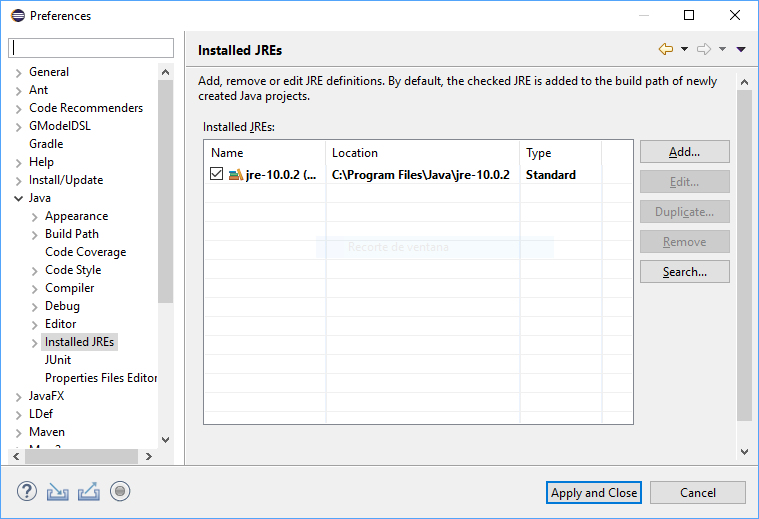
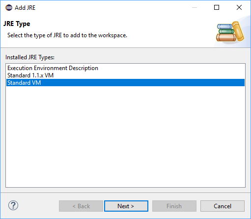
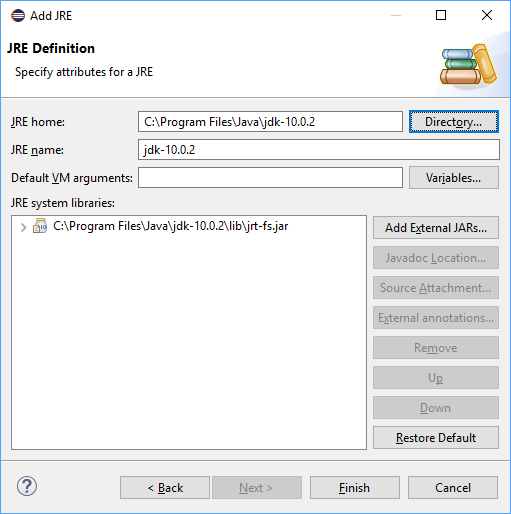
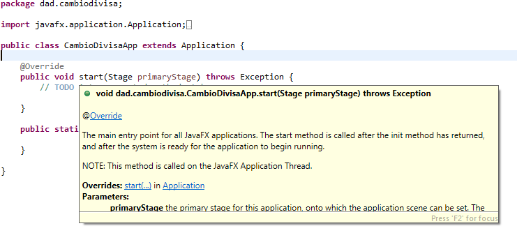

A continuación se explican los pasos para poder explorar los fuentes de las librerías de la API de Java, así como asociar el Javadoc correspondiente a Eclipse, para que cuando estemos escribiendo código podamos consultar ayuda directamente desde el editor colocando el puntero de ratón sobre el código (Tooltip), así como que Eclipse nos ponga los nombres correctos de los parámetros y variables generadas por él.

1. Descargamos el Javadoc para [Java SE 10](https://www.oracle.com/technetwork/java/javase/documentation/jdk10-doc-downloads-4417029.html).

2. Copiamos el fichero descargado dentro de la carpeta del JDK. En mis caso: 

   ```
   C:\Program Files\Java\jdk-10.0.2\jdk-10.0.2_doc-all.zip
   ```

3. En Eclipse, abrimos **Windows > Preferences**, y buscamos **Java > Installed JREs**.

   

4. Pulsamos el botón **Add** para añadir el JDK, y en el diálogo **Add JRE** seleccionamos máquina **Standard VM** y pulsamos **Next**.

   

5. Pulsamos el botón **Directory** y localizamos y seleccionamos la ruta donde está instalado el JDK.

   

6. Seleccionamos la librería del sistema en la lista **JRE system libraries** (sólo hay una) y pulsamos el botón **Javadoc Location**. Marcamos **Javadoc in archive**, pulsamos el botón **Browse** en **Archive path**, y localizamos el fichero ZIP con el Javadoc del código de la JVM, y pulsamos **OK** para terminar.

   

7. Volvemos a la ventana **Preferences** de Eclipse y localizamos **Execution environments**.

   

8. Seleccionamos el entorno de ejecución correspodiente en el panel **Execution environments** (en nuestro caso, **JavaSE-10**) y marcamos en el panel de la derecha el *JDK* en lugar del *JRE* (tal y como se ve en la imagen de arriba).

9. Pulsamos **Apply and close**.

Y listo, ahora Eclipse nos ayudará un poco más, por ejemplo, cuando despleguemos un tooltip sobre una parte de código de la API de Java:

