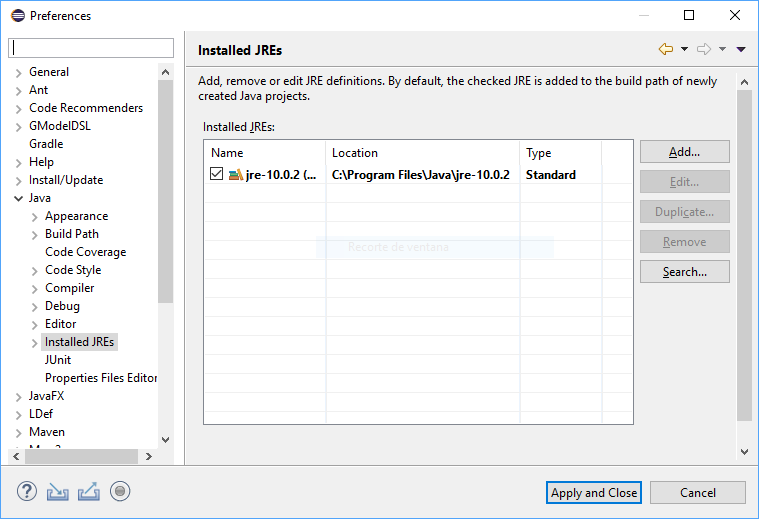
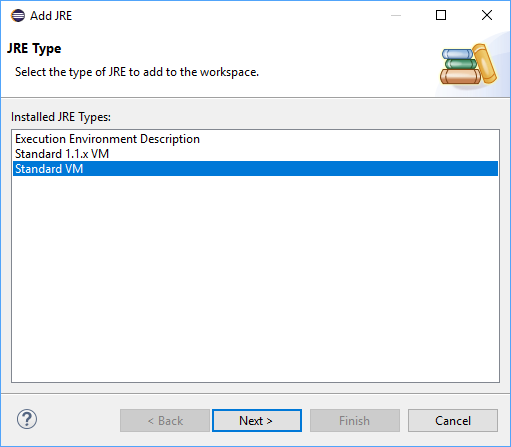
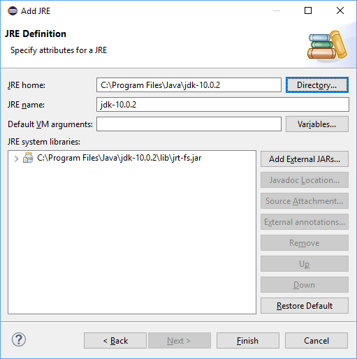
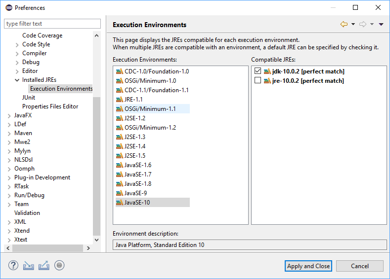

# Configurar Javadoc en Eclipse

A continuación se explican los pasos para poder explorar los fuentes de las librerías de la API de Java, así como asociar el **Javadoc** correspondiente a Eclipse, para que cuando estemos escribiendo código podamos consultar ayuda directamente desde el editor colocando el puntero de ratón sobre el código (**tooltip**), así como que Eclipse nos ponga los nombres correctos de los parámetros y variables generadas por él.

1. Descargamos el Javadoc (por ejemplo, para [Java SE 10](https://www.oracle.com/technetwork/java/javase/documentation/jdk10-doc-downloads-4417029.html)).

2. Copiamos el fichero descargado dentro de la carpeta del JDK. En mis caso: 

   ```bash
   C:\Program Files\Java\jdk-10.0.2\jdk-10.0.2_doc-all.zip
   ```

3. En Eclipse, abrimos **Windows > Preferences**, y buscamos **Java > Installed JREs**.

   

4. Pulsamos el botón **Add** para añadir el JDK, y en el diálogo **Add JRE** seleccionamos máquina **Standard VM** y pulsamos **Next**.

   

5. Pulsamos el botón **Directory** y localizamos y seleccionamos la ruta donde está instalado el JDK.

   

6. Seleccionamos la librería del sistema en la lista **JRE system libraries** (sólo hay una) y pulsamos el botón **Javadoc Location**. Marcamos **Javadoc in archive**, pulsamos el botón **Browse** en **Archive path**, y localizamos el fichero ZIP con el Javadoc del código de la JVM, y pulsamos **OK** para terminar.

   

7. Volvemos a la ventana **Preferences** de Eclipse y localizamos **Execution environments**.

   

8. Seleccionamos el entorno de ejecución correspodiente en el panel **Execution environments** (en nuestro caso, **JavaSE-10**) y marcamos en el panel de la derecha el *JDK* en lugar del *JRE* (tal y como se ve en la imagen de arriba).

9. Pulsamos **Apply and close** y listo, ahora Eclipse nos ayudará un poco más, por ejemplo, cuando despleguemos un tooltip sobre una parte de código de la API de Java:

	