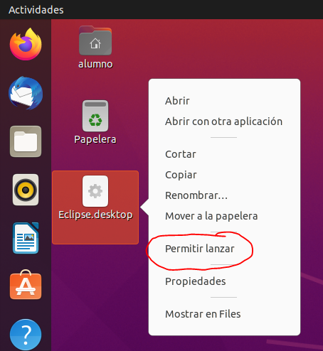

# Cómo preparar un entorno de desarrollo Java en GNU/Linux

Esta guía explica cómo preparar un entorno de desarrollo Java en GNU/Linux desde la línea de comandos, lo que permitiría automatizar todo el proceso de configuración mediante un script.

Éste es el software que se va a instalar a continuación:

- AdoptOpenJDK 14
- Eclipse for Java developers
- Maven
- Git
- Typora

## Instalar el gestor de paquetes SDKMAN!

El gestor de paquetes **SDKMAN!** facilita la instalación de software para desarrolladores en sistemas Mac OS y GNU/Linux (*nix).

Para instalarlo abre un terminal y ejecuta el siguiente comando:

```bash
curl -s "https://get.sdkman.io" | bash
```

> SDKMAN! instala el software sólo para el usuario que ejecuta el comando, por eso no es necesario ejecutar el comando anterior con privilegios elevados (`sudo`).

> Es necesario abrir un terminal nuevo para poder empezar a utilizar el comando `sdk`.

## Instalar AdoptOpenJDK

Para instalar la versión 14 de **AdoptOpenJDK**, abre un terminal y ejecuta el siguiente comando:

```bash
sdk install java 14.0.2.j9-adpt
```

> Si quieres instalar una versión diferente consulta las versiones disponibles mediante el siguiente comando:
>
> ```bash
> sdk list java
> ```

## Instalar Eclipse 

Descargar la última versión de Eclipse for Java developers (en este caso es **2020-09-R**):

```bash
wget https://mirrors.dotsrc.org/eclipse//technology/epp/downloads/release/2020-09/R/eclipse-java-2020-09-R-linux-gtk-x86_64.tar.gz
```

> Desde este [enlace](https://www.eclipse.org/downloads/packages/) podemos descargar otra versión de Eclipse.

Extraer Eclipse del fichero descargado antes y moverlo a `/opt`:

```bash
tar xvfz eclipse-java-2020-09-R-linux-gtk-x86_64.tar.gz
sudo mv eclipe /opt
```

Establecer a `root` como propietario y cambiar los permisos:

```bash
sudo chown root:root /opt/eclipse
sudo chmod 755 /opt/eclipse
```

Crear un acceso directorio en el **Escritorio** (o **Desktop**):

```sh
cat > ~/Escritorio/Eclipse.desktop <<EOL
[Desktop Entry]
Name=Eclipse
Type=Application
Exec=/opt/eclipse/eclipse
Terminal=false
Icon=/opt/eclipse/icon.xpm
Comment=Eclipse for Java developers
NoDisplay=false
Categories=Development;IDE;
Name[en]=Eclipse
Name[en_US]=Eclipse
EOL
```

Creamos un enlace simbólico al JDK dentro del directorio donde instalamos Eclipse para que pueda localizarlo:

```bash
sudo ln -s ~/.sdkman/candidates/java/current /opt/eclipse/jre
```

Finalmente, en el entorno de escritorio, desplegamos el menú del icono y seleccionamos **Permitir lanzar**:



## Instalar Maven

Para instalar la última versión de **Maven**, abre un terminal y ejecuta el siguiente comando:

```bash
sdk install maven
```

## Instalar Git 

Para instalar la **Git**, abre un terminal y ejecuta el siguiente comando:

```bash
sudo apt install -y git
```

## Instalar Typora

Abre un terminal y ejecuta los siguientes comando para instalarlo:

```bash
wget -qO - https://typora.io/linux/public-key.asc | sudo apt-key add -
sudo add-apt-repository 'deb https://typora.io/linux ./'
sudo apt-get update
sudo apt-get install typora
```

## Referencias

- [SDKMAN!](https://sdkman.io/)
- [Typora](https://typora.io/#linux)