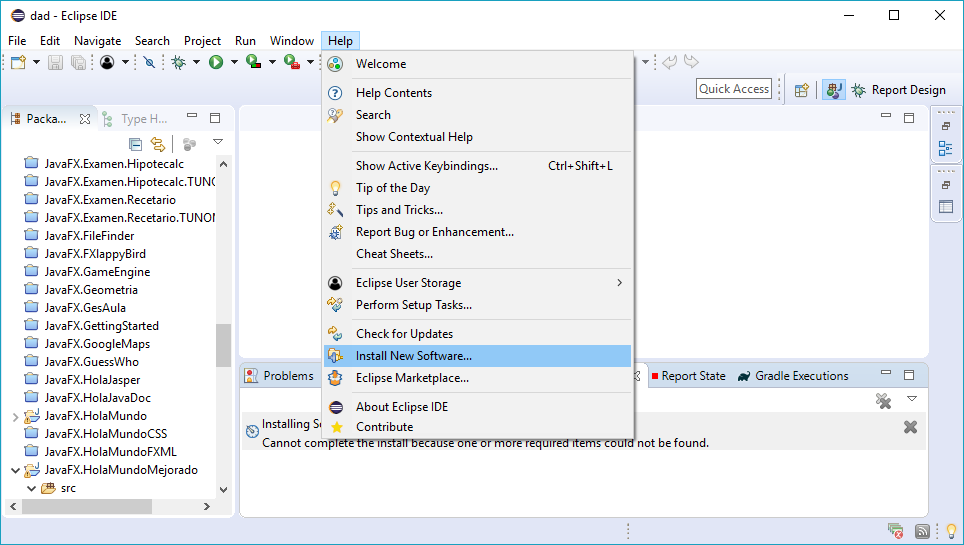
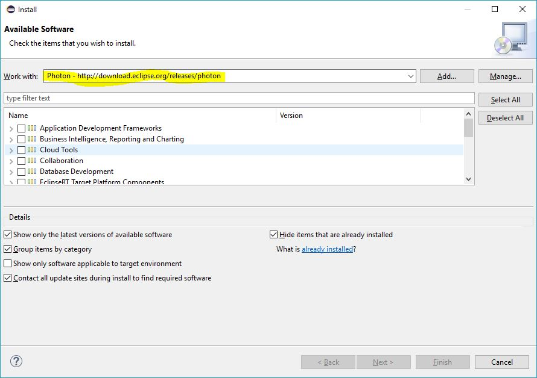
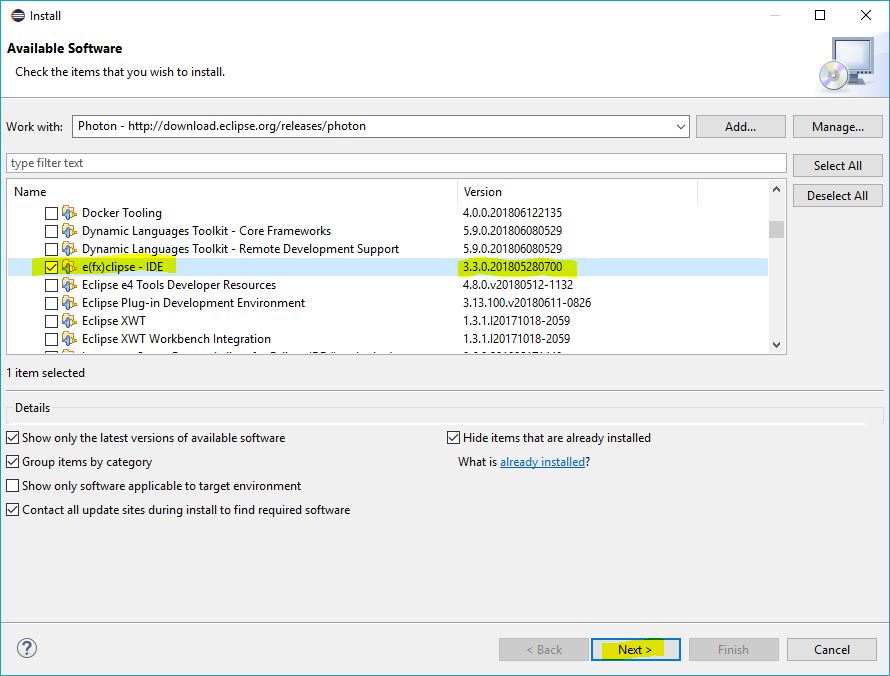
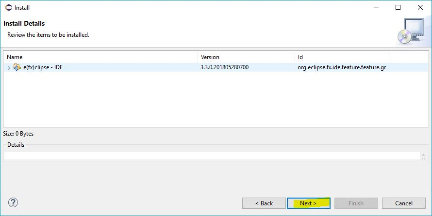
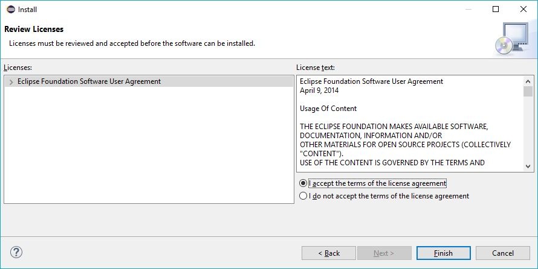
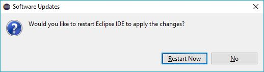

# Instalar el plugin e(fx)clipse

Para instalar el plugin **e(fx)clipse** en Eclipse Photon debemos seguir los siguientes pasos:

1. Elegir la opción `Install new software` del menú `Help`.

	

2. Seleccionar http://download.eclipse.org/releases/photon del desplegable `Work with`.

	

3. En la lista inferior desplegar la opción `General purpose tools,` marcar **e(fx)clipse - IDE**, y pulsar `Next`.

	

4. Nos muestra lo que hemos seleccionado para instalar y volvemos a pulsar `Next`.

	

5. Aceptamos los términos de la licencia y pulsamos `Finish`, de modo que comienza la instalación del plugin.

	

6. Cuando termine, reiniciamos Eclipse, y ya tendremos el plugin e(fx)clipse adecuado instalado en nuestro entorno Eclipse.

	