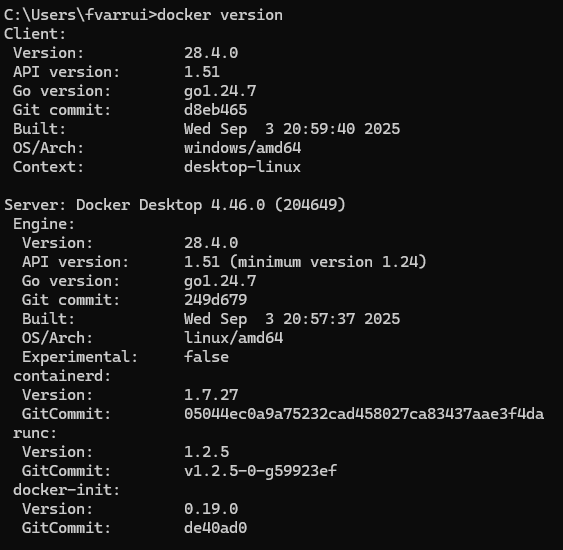
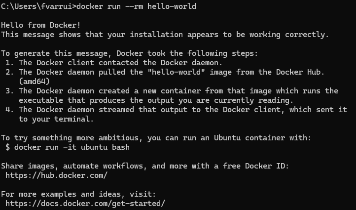
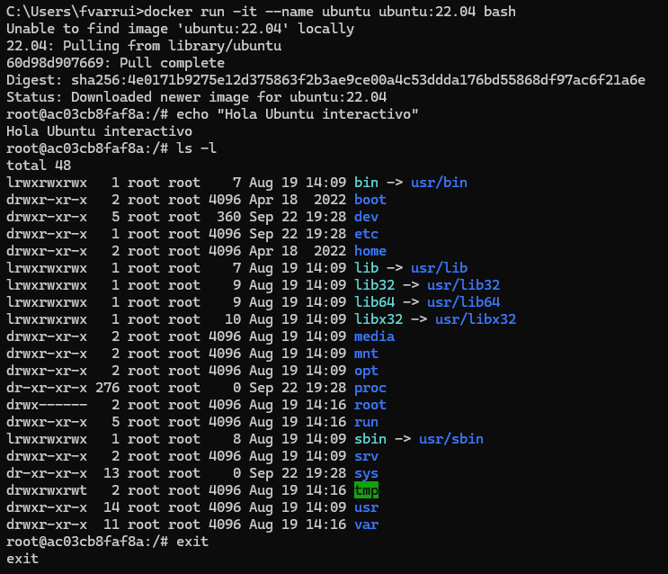
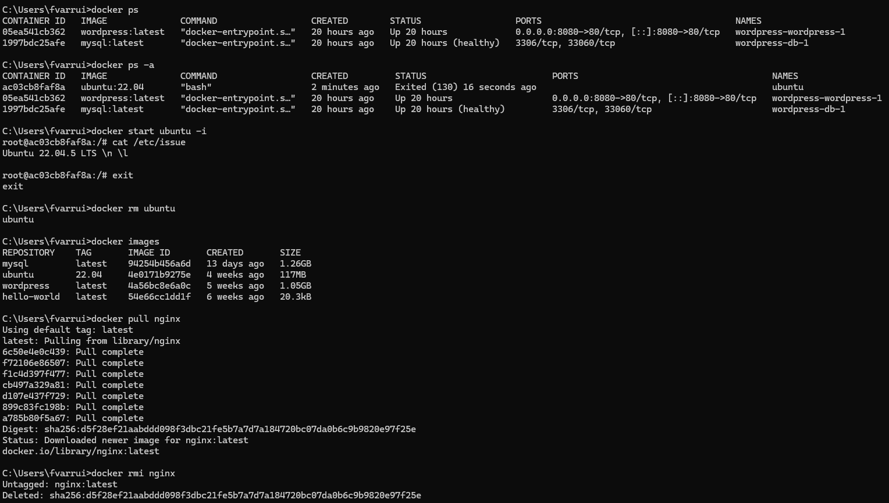
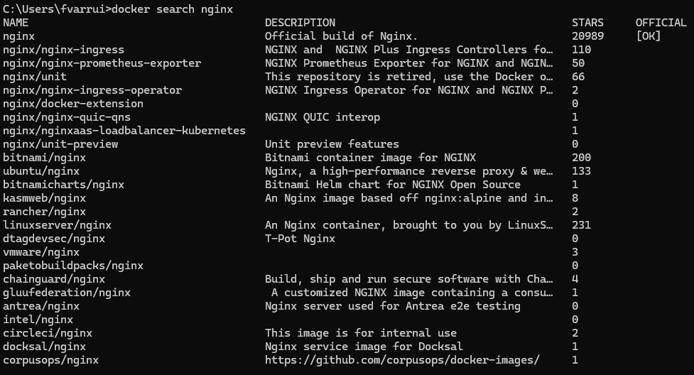
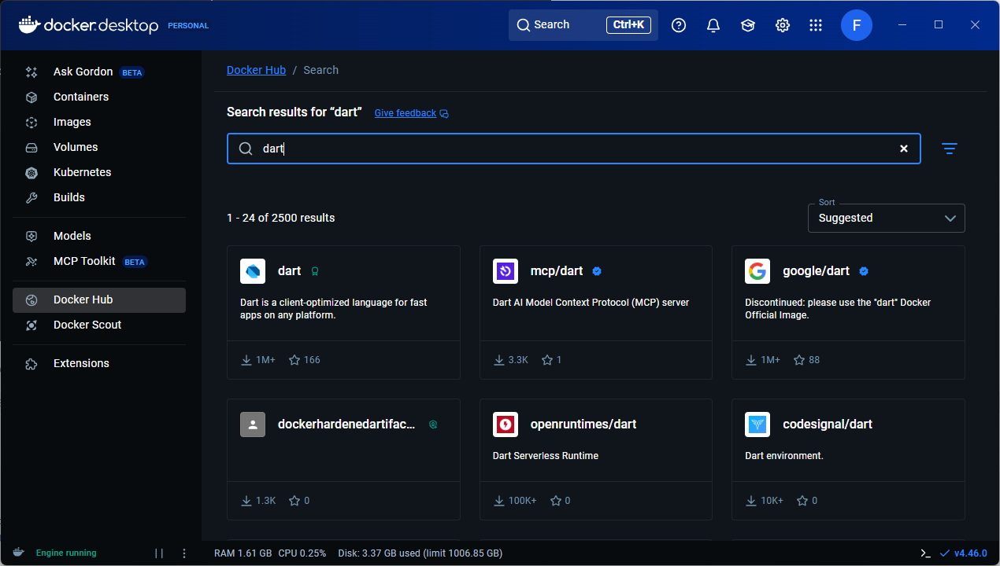
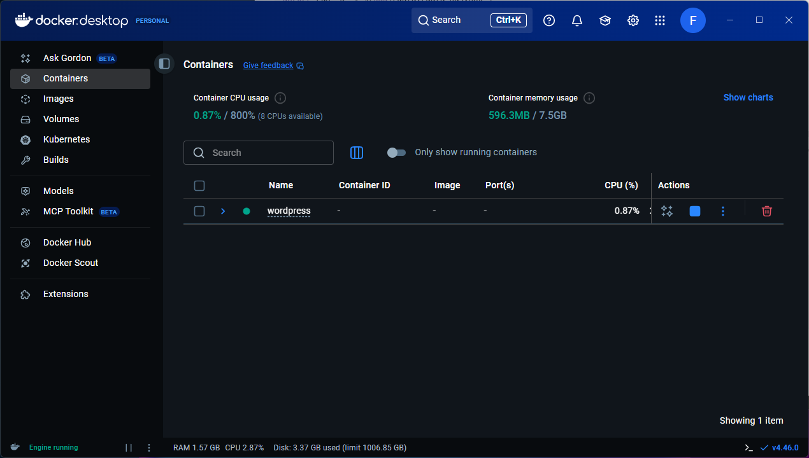

# Guía rápida de Docker

Docker permite empaquetar aplicaciones y dependencias en contenedores ligeros y reproducibles. Con Docker puedes ejecutar servicios de forma aislada, definir stacks con Compose y compartir imágenes a través de Docker Hub.

## 🐳 ¿Qué #$%@ es Docker?

Docker es una herramienta que te permite **empaquetar una aplicación** con todo lo que necesita (código, librerías, dependencias, configuración) dentro de un **contenedor**.

### 📦 ¿Qué es una imagen?

Una **imagen** es como una **plantilla** o **molde** que define qué hay dentro: sistema base, librerías, tu app, etc. Puedes pensar en ella como una **foto** de un sistema con todo lo necesario para ejecutar tu aplicación.

### 🚀 ¿Y un contenedor?

El **contenedor** es la **instancia en ejecución** de esa imagen. Puedes tener varios contenedores corriendo a partir de la misma imagen, cada uno aislado, en la misma máquina 😯.

### 🏗️ ¿Cómo funciona Docker por dentro?


### 🫤 ¿Y para qué me sirve a mí eso?

Pues para nada, a menos que quieras:

- Desarrollar y probar aplicaciones de forma consistente en cualquier entorno. ‼️
- Desplegar aplicaciones en producción sin preocuparte por diferencias entre servidores. ‼️
- Ejecutar múltiples servicios aislados en un mismo equipo (bases de datos, caches, colas de mensajes, etc.).
- Compartir tu aplicación fácilmente con otros (compartiendo la imagen).
- Simplificar la configuración y gestión de entornos complejos con Docker Compose.
- Facilitar la integración continua y despliegue continuo (CI/CD).
- Aislar aplicaciones para mejorar la seguridad y evitar conflictos entre dependencias.
- ¿Quieres que siga?

### ⚙️ Vale, ¿y cómo funciona?

Te explico:

1. Por un lado tienes una **imagen** (el "molde"), que define lo que hay dentro: sistema base (ej. Ubuntu), librerías, tu app.
2. Con esa imagen lanzas un **contenedor** (una instancia en ejecución).
3. El contenedor se ejecuta siempre igual, sin importar dónde lo ejecutes, porque ya lleva todo lo necesario.

### 🔑 ¿Y qué diferencia una máquina virtual de un contenedor?

Una **máquina virtual (MV)** incluye un sistema operativo completo, lo que la hace pesada y lenta de arrancar. Un **contenedor**, en cambio, comparte el kernel del sistema operativo del host, por lo que es mucho más ligero y rápido.


### 🧩 Dame un ejemplo

Imagina que tienes una app en **Node.js**. Normalmente tendrías que instalar Node, configurar dependencias, versiones, etc.

Bueno, pues con Docker:

* Creas un `Dockerfile` que dice: "en un Ubuntu, instala Node 20, copia mi app, ejecútala".
* Lo construyes en una **imagen**.
* Esa imagen la puedes pasar a otra persona o servidor y se ejecuta igual en todos lados, sin preocuparte por instalaciones.

Maravilloso, ¿no?

> ℹ️ Docker hace que tus apps viajen en contenedores portátiles, ligeros y listos para funcionar igual en cualquier sitio.

## Instalación de Docker

### ¿Qué necesito?

- Tener la virtualización habilitada (Intel VT-x/AMD-V) en BIOS/UEFI.
- En Windows y macOS: Docker Desktop.
- En Linux: Docker Engine (docker-ce).

### Windows (Chocolatey)

Ejecuta el siguiente comando en PowerShell como administrador:

```powershell
choco install docker-desktop -y
```

Es recomendable activar WSL 2 (Windows 10 2004+ / 11) de la siguiente manera: 

```powershell
wsl --install
```

Luego puedes abrir **Docker Desktop** y espera a que indique `Engine running` (esto indica que el servicio/motor de Docker se está ejecutando).

> ⚠️ Si el servicio no está iniciado en Windows, en PowerShell puedes arrancarlo con `Start-Service com.docker.service` (como administrador).

### macOS (Homebrew)

Abre el terminal y ejecuta el siguiente comando:

```bash
brew install --cask docker
```

> ℹ️ La opción `--cask` es necesaria para instalar aplicaciones gráficas.

Luego inicia la app Docker y valida con `docker version`.

> ⚠️ Esta parte está sin probar, ya que soy pobre y no tengo macOS. Así que si alguien lo prueba y ve que hay que cambiar algo, que haga un **pull request**.

### Linux (Debian/Ubuntu)

Vamos a hacer la instalación desde los repositorios oficiales de Docker.

Primero descargamos e instalamos el certificado de Docker:

```bash
curl -fsSL https://download.docker.com/linux/ubuntu/gpg | sudo gpg --dearmor -o /etc/apt/keyrings/docker.gpg
```  

Añadimos el repositorio oficial de Docker:

```bash
echo \
  "deb [arch=$(dpkg --print-architecture) signed-by=/etc/apt/keyrings/docker.gpg] \
  https://download.docker.com/linux/ubuntu $(lsb_release -cs) stable" | \
  sudo tee /etc/apt/sources.list.d/docker.list > /dev/null
```

Actualizamos e instalamos todos los paquetes necesarios de Docker:

```bash
sudo apt update
sudo apt install -y docker-ce docker-ce-cli containerd.io docker-compose-plugin
```

Para no tener que usar `sudo` cada vez que ejecutemos el comando `docker`, debemos meter a nuestro usuario en el grupo `docker` y reiniciar la sesión:

```bash
sudo usermod -aG docker $USER
```

> ⚠️ Si el servicio no está iniciado, en Linux puedes arrancarlo con `sudo systemctl start docker`.

### Verificar la instalación

Para verificar que Docker se ha instalado correctamente, ejecuta:

```bash
docker version
```



## Docker CLI (controlando Docker desde la terminal)

### Hola mundo 

Para comprobar que todo funciona correctamente, podemos ejecutar iniciar un contenedor con la imagen `hello-world` (se descargará automáticamente de Docker Hub si no se ha descargado ya) y mostrará un mensaje de bienvenida:

```bash
docker run --rm hello-world
```



> ℹ️ La opción `--rm` indica que el contenedor se elimine automáticamente al finalizar.

> ¡Esto indica que todo guay! 😎

### Ubuntu interactivo

Ahora vamos a lanzar un contenedor interactivo con Ubuntu 22.04:

```bash
docker run -it --name ubuntu ubuntu:22.04 bash
```



> ℹ️ La opción `-it` indica que queremos una terminal interactiva, `--name` asigna un nombre al contenedor y `bash` es el comando que se ejecuta al iniciar.

### Gestión básica

```bash
docker ps                  # contenedores en ejecución
docker ps -a               # todos los contenedores

docker stop <id|nombre>    # parar
docker start <id|nombre>   # iniciar

docker rm <id|nombre>      # eliminar contenedor

docker images              # imágenes locales
docker pull ubuntu:22.04   # descargar imagen
docker rmi <imagen>        # eliminar imagen
```



### Buscar imágenes en Docker Hub

Docker Hub es el registro público de imágenes de Docker. Puedes buscar imágenes con:

```bash
docker search nginx
```



O también puedes buscarlas desde Docker Desktop:



> ℹ️ Las immágenes oficiales tienen el prefijo `library/`.

### Puertos, volúmenes y redes

```bash
docker run -d -p 8080:80 nginx            # exponer puerto

docker run -d -v ./data:/data busybox \
  sh -c "while true; do date >> /data/log.txt; sleep 5; done"

# Red nombrada
docker network create mi-red
```

## Docker Desktop (controlando Docker desde la GUI)

**Docker Desktop** incluye Docker Engine, Docker CLI, Docker Compose, una interfaz gráfica para gestionar contenedores e imágenes, integración con WSL 2 (en Windows), y herramientas adicionales como Docker Compose V2 y configuraciones de red/volúmenes. Es un paquete completo para Windows y macOS.



Desde la interfaz gráfica puedes:
- Ver y gestionar contenedores, imágenes, volúmenes y redes.
- Encontrar y descargar imágenes desde Docker Hub.
- Configurar recursos (CPU, memoria, disco).
- Acceder a la terminal integrada.
- Configurar integraciones con WSL 2 (Windows).
- Actualizar Docker Desktop y sus componentes.
- Acceder a documentación y soporte.
- Configurar proxies y certificados.
- Gestionar preferencias de inicio y actualizaciones automáticas.
- Ver logs y diagnósticos.
- Integrar con Kubernetes (opcional).
- Y más...

## Docker Compose (v2)

Define un stack multi-contenedor con un archivo `compose.yaml` y levántalo:

```bash
docker compose up -d     # levantar en segundo plano
docker compose ps        # ver estado
docker compose logs -f   # seguir logs
docker compose down      # parar y limpiar (mantiene volúmenes salvo --volumes)
```

## ¿Dónde encontrar imágenes?

- Docker Hub: https://hub.docker.com
- Imágenes oficiales (prefijo `library/`): nginx, redis, mysql, postgres, ubuntu, etc.

## Ejemplos prácticos

A continuación, ejemplos mínimos para escenarios comunes.

### 1) Ubuntu (contenedor interactivo)

```bash
docker run -it --name ubuntu-jammy ubuntu:22.04 bash
# dentro del contenedor
apt-get update && apt-get install -y curl git
```

### 2) WordPress + MySQL (Compose)

Crea `compose.yaml` en una carpeta vacía y ejecuta `docker compose up -d`.

```yaml
services:
  db:
    container_name: mysql-db
    image: mysql:latest
    environment:
      MYSQL_DATABASE: wordpress
      MYSQL_USER: wp
      MYSQL_PASSWORD: wp_pass_123
      MYSQL_ROOT_PASSWORD: root_pass_123
    volumes:
      - ./db_data:/var/lib/mysql
    healthcheck:
      test: ["CMD", "mysqladmin", "ping", "-h", "localhost"]
      interval: 10s
      timeout: 5s
      retries: 5
  wordpress:
    container_name: wordpress-site
    image: wordpress:latest
    depends_on:
      db:
        condition: service_healthy
    environment:
      WORDPRESS_DB_HOST: db:3306
      WORDPRESS_DB_USER: wp
      WORDPRESS_DB_PASSWORD: wp_pass_123
      WORDPRESS_DB_NAME: wordpress
    ports:
      - "8080:80"
    volumes:
      - ./wp_data:/var/www/html
volumes:
  db_data:
  wp_data:
```

Una vez hemos levantado los servicios, podemos acceder a WordPress en: [http://localhost:8080](http://localhost:8080).

### 3) SQL Server 2022 (Linux)

Ejecutar una instancia Developer en Linux. Requiere aceptar la EULA.

```bash
docker run -e "ACCEPT_EULA=Y" -e "MSSQL_SA_PASSWORD=Str0ng_Pass!" \
  -p 1433:1433 --name sql2022 -d \
  mcr.microsoft.com/mssql/server:2022-latest
```

Compose equivalente (`compose.yaml`):

```yaml
services:
  mssql:
    image: mcr.microsoft.com/mssql/server:2022-latest
    environment:
      ACCEPT_EULA: "Y"
      MSSQL_SA_PASSWORD: "Str0ng_Pass!"
      MSSQL_PID: "Developer"
    ports:
      - "1433:1433"
    volumes:
      - mssql_data:/var/opt/mssql
volumes:
  mssql_data:
```

Conexión desde el host: `127.0.0.1,1433` (usuario `sa`). Cambia la contraseña.

### 4) Contenedor Windows (Server Core)

Solo en Windows con Docker Desktop en modo Windows Containers (no disponible en macOS/Linux).

```powershell
# Cambiar a Windows containers desde el icono de Docker Desktop
# Luego, en PowerShell:
docker pull mcr.microsoft.com/windows/servercore:ltsc2022

docker run -it --name win-core mcr.microsoft.com/windows/servercore:ltsc2022 powershell
```

> ⚠️ La versión del host debe coincidir con la de la imagen (compatibilidad de kernel).

## Construir imágenes propias

Ejemplo de `Dockerfile` para una app Node.js simple:

```dockerfile
FROM node:20-alpine
WORKDIR /app
COPY package*.json ./
RUN npm ci --only=production
COPY . .
EXPOSE 3000
CMD ["node", "server.js"]
```

```bash
docker build -t miapp:1.0 .
docker run -d -p 3000:3000 --name miapp miapp:1.0
```

## Consejos y solución de problemas

- Permisos en Linux: añade tu usuario al grupo `docker` y reinicia sesión.
- Puertos ocupados: cambia el puerto host `-p 8081:80` o libera el puerto.
- Limpieza: `docker system prune -f` y `docker volume prune -f` (cuidado: elimina recursos no usados).
- Logs: `docker logs -f <contenedor>` y `docker compose logs -f`.
- Recursos: limita CPU/memoria con `--cpus` y `-m` o en Compose (`deploy.resources`).

## Recursos

- [Documentación oficial de Docker](https://docs.docker.com)
- [Documentación oficial de Docker Compose](https://docs.docker.com/compose/)
- [Docker Hub (repositorio de imágenes)](https://hub.docker.com)
