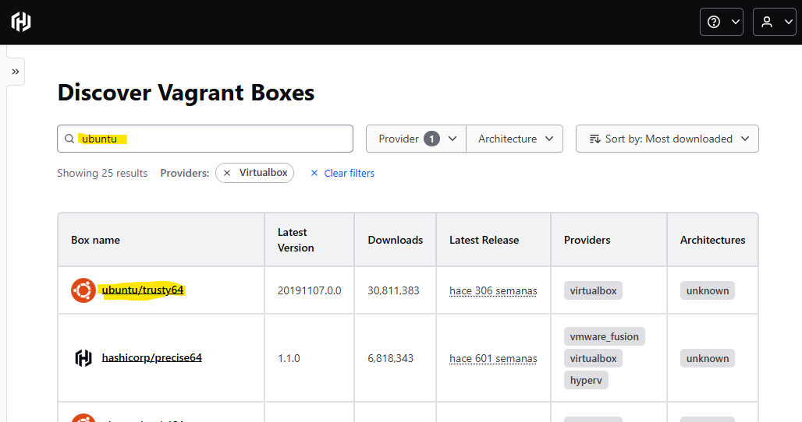
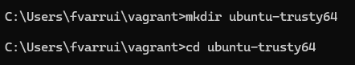
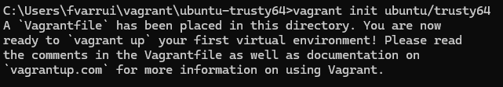
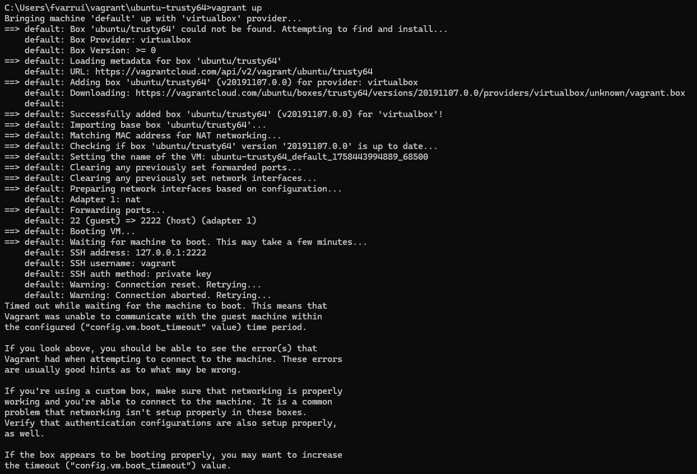
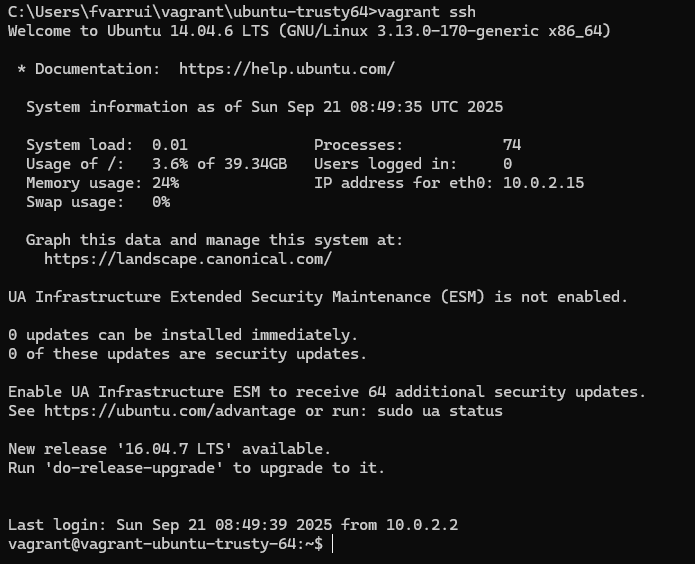
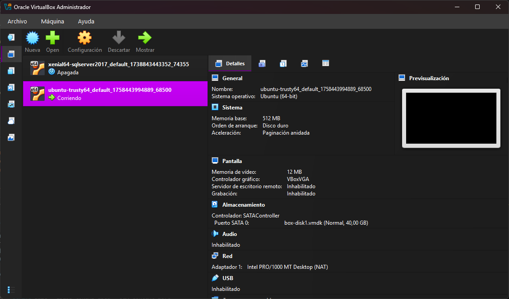
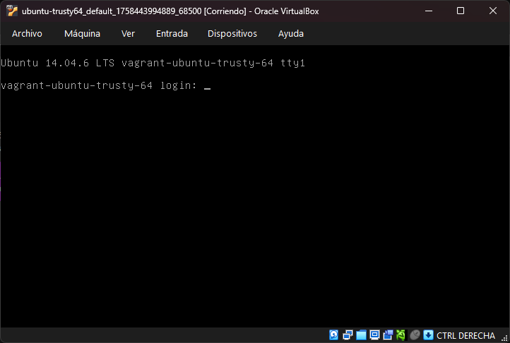
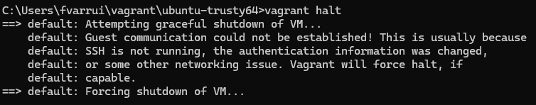

# Guía rápida de Vagrant

Vagrant facilita la creación y gestión de máquinas virtuales para entornos de desarrollo. Con una configuración sencilla, puedes levantar y destruir entornos completos (máquinas virtuales) con un solo comando.

## Requisitos

- Un proveedor de virtualización (por ejemplo, `VirtualBox`, `Hyper‑V` o `VMware`).
- Vagrant instalado en tu sistema.

> ⚠️ algunos proveedores requieren habilitar virtualización (Intel VT‑x/AMD‑V) en BIOS/UEFI.

## Instalación

### Windows (Chocolatey)

```powershell
choco install vagrant -y
choco install virtualbox -y   # proveedor recomendado si no usas Hyper-V
```

> ℹ️ Alternativa: activar `Hyper‑V` en Windows Pro/Enterprise y usarlo como proveedor.

### macOS (Homebrew)

```bash
brew install --cask vagrant
brew install --cask virtualbox   # proveedor recomendado
```

### Linux

- Debian/Ubuntu:

```bash
sudo apt-get update
sudo apt-get install -y vagrant virtualbox
```

- Fedora:

```bash
sudo dnf install -y vagrant @virtualization
```

- Arch:

```bash
sudo pacman -S vagrant virtualbox
```


## Primeros pasos

### Inicializar una máquina virtual

Primero debemos inicializar un proyecto Vagrant en una carpeta nueva. Esto crea un archivo `Vagrantfile` con la configuración básica.

```bash
mkdir mi-maquina && cd mi-maquina
vagrant init ubuntu/trusty64   # crea Vagrantfile usando la box indicada
```

> ℹ️ Una **box** es una plantilla base para la VM, que incluye el sistema operativo y puede tener software preinstalado.

### Arrancar la máquina

En el directorio donde está el `Vagrantfile`, ejecuta:

```bash
vagrant up        # descarga la box (si no existe) y arranca la VM
vagrant ssh       # entrar por SSH (si el SO invitado lo soporta)
```

### Operaciones comunes

Luego podemos gestionar la VM con estos comandos:

```bash
vagrant halt      # apagar
vagrant reload    # reiniciar aplicando cambios del Vagrantfile
vagrant destroy   # eliminar la VM (pide confirmación)
```

### Boxes locales

Puedes gestionar las boxes locales con estos comandos:

```bash
vagrant box list                 # ver boxes descargadas
vagrant box add <box>            # descargar una box manualmente
vagrant box remove <box>         # eliminar una box
```

## ¿Dónde encontrar boxes?

Puedes usar boxes públicas o crear las tuyas propias. Una buena fuente de boxes públicas es:

- [Vagrant Cloud](https://portal.cloud.hashicorp.com/vagrant/discover)

Puedes buscar boxes según tus necesidades, por ejemplo:

- `ubuntu/jammy64`: Ubuntu 22.04 LTS
- `bitnami/wordpress`: WordPress preinstalado
- `gusztavvargadr/windows-11`: Windows 11 para desarrollo (evaluación)

> ℹ️ Estas imágenes suelen ser grandes. Asegúrate de tener espacio en disco y habilitada la virtualización.

> ⚠️ Usa solo con fines de desarrollo/pruebas y revisa términos de uso.

## Ejemplo completo

Vamos a crear una VM con Ubuntu Trusty64:

### 1. Localizamos la box en [Vagrant Cloud](https://portal.cloud.hashicorp.com/vagrant/discover)



### 2. Creamos un directorio y nos situamos en él



### 3. La inicializamos



### 4. La arrancamos

>  ⚠️La primera vez tarda más porque descarga la box.



### 5. Entramos por SSH

Una vez arrancada, podemos entrar por SSH:



> ℹ️ Por convención, las MVs de Vagrant Cloud usan `vagrant`/`vagrant` como usuario/contraseña.

### 6. Acceder a la MV en modo gráfico (opcional)

Si la box lo soporta, podemos usar la interfaz gráfica abriendo VirtualBox:



Ahí vemos que nuestra máquina está corriendo, y pulsamos mostrar para verla:



### 7. Apagar y destruir la máquina

Cuando terminemos, podemos apagarla:



## Tips y resolución de problemas

- Si `vagrant up` falla por el proveedor, instala/selecciona uno disponible: `vagrant up --provider virtualbox`.
- En Windows con Hyper‑V, deshabilita/activa según lo necesites para no interferir con VirtualBox.
- Para regenerar la VM sin perder el Vagrantfile: `vagrant destroy -f && vagrant up`.
- Puedes fijar la versión de una box editando el Vagrantfile: `config.vm.box_version = "= 202401.01.0"`.
- Sin SSH en Windows, usa `vagrant rdp` (si la box lo habilita) o la GUI.

## Recursos

- [Documentación oficial de Vagrant](https://developer.hashicorp.com/vagrant/docs)